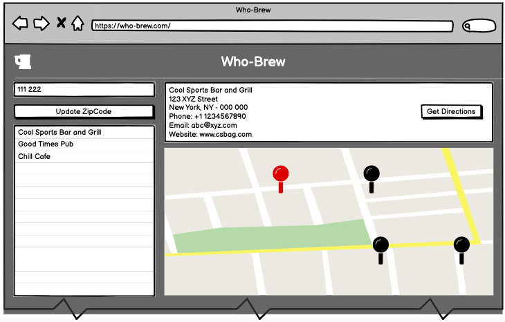

# Who-Brew

A cool and simple application using 'Open Brewery DB' and 'Google Maps' APIs to give user the capability to search for breweries in the area. The application is interactive, it gets user's location through a modal window and searches for breweries in the area and displays the Google Maps iFrame with pins/markers depicting locations of brewries.

## User Story 1

```
AS A user
I WANT TO visit the Who-Brew application
SO THAT I can view and use the application features
```

### Acceptance Criteria

```
GIVEN I am visiting the Who-Brew application URL
WHEN I visit the URL from my browser
THEN the Who-Brew homepage is displayed
AND the Who-Brew page header displays the logo and title
AND the page displays the application description
AND the page displays a button to let the user start using the features
```

## User Story 2

```
AS A user
I WANT TO enter my postal code
SO THAT I can view the results based on my location
```

### Acceptance Criteria

```
GIVEN I am on the Who-Brew homepage
WHEN I click on the let's go button
THEN a modal is displayed
AND I can enter my postal code in an input field on the modal
WHEN I click on the search button
THEN the search results page is displayed
WHEN the search results page is displayed
THEN the map is focused on my city
AND all results are from my city
```

## User Story 3

```
AS A user
I WANT TO view the search results for breweries around me
SO THAT I can plan my visit and have a good time
```

### Acceptance Criteria

```
Given I am on the Breweries Result page
WHEN I view the page
THEN I see a list of all brewries in my city
AND I see all breweries marked on the map
WHEN I click on any brewery from the list
THEN I see the corresponding marker highlighted on the map
WHEN I click on any marker on the map
THEN I see the corresponding brewery highlighted in the list
```

## Wireframes

* Homepage


* Search Modal


* Breweries Result page


## Review

* URL: 
https://dawsontilley.github.io/who-brew/

* Repository: 
https://github.com/dawsontilley/who-brew

* Screenshot:
